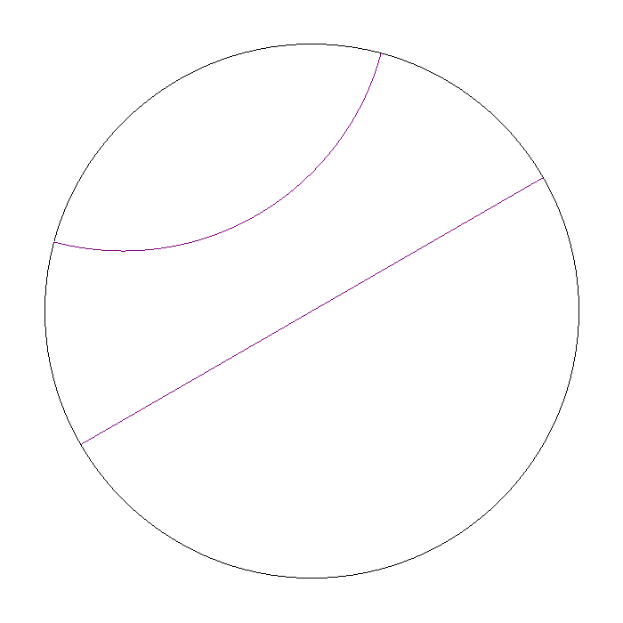
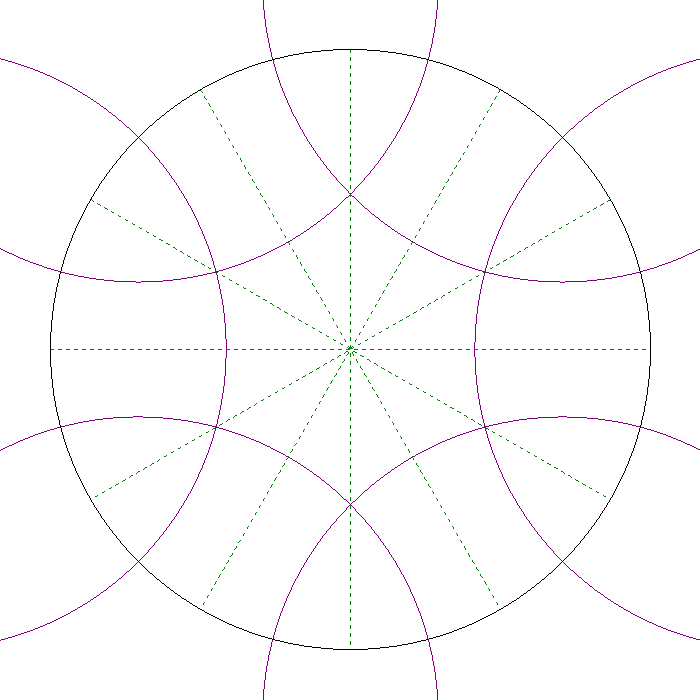
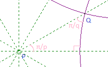
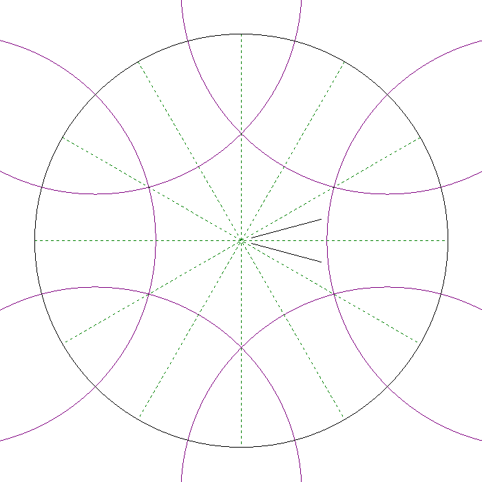
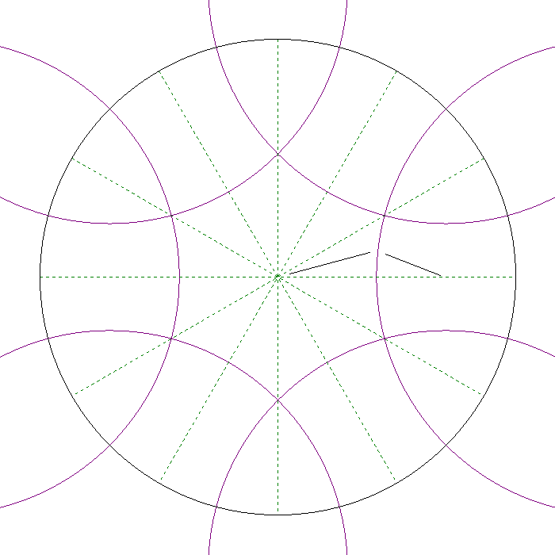
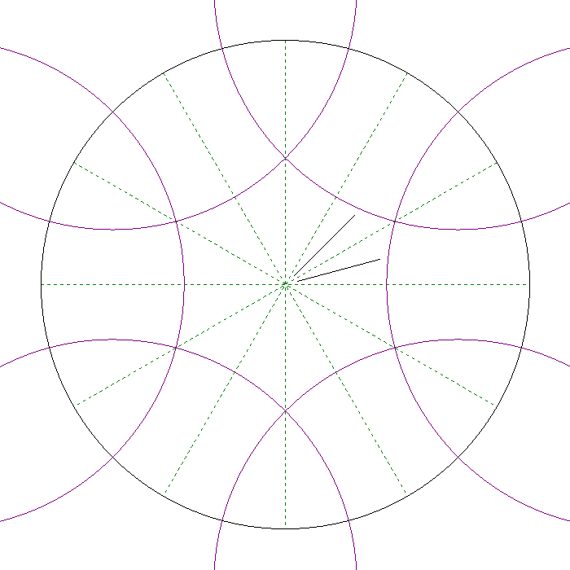

# Hyperbolic geometry and patterns

Hyperbolic geometry is a non-Euclidean geometry, where the only difference compared to (normal) Euclidean geometry is that the Euclidean axiom  
> In a plane, given a line and a point not on it, at most one line parallel to the given line can be drawn through the point. [6]  

is replaced with  

> For any given line R and point P not on R, in the plane containing both line R and point P there are at least two distinct lines through P that do not intersect R. [7]

A hyperbolic plane can be represented by the unit disk in an Euclidean plan, the Poincaré disk model, where the straight lines are lines through the origin and circle arcs intersecting the boundary circle in 90 angles of 90 degrees. (Yes, circle arcs are lines). [8] In the Poincaré disk model the angles are the same as the if the model was Euclidean, but the distances are not the same as in Euclidean geometry. A segment closer to the bundary circle has longer hyperbolic distance than if the same piece was closer to the origin of the circle. Hence, the repeating patterns we will see on the disk will actually have the same size and actually be identical in hyperbolic geometry.

<figure>
  
  <figcaption>Hyperbolic lines</figcaption>
</figure>

## The implementation
The code for drawing hyperbolic patterns in the repo is based on Dunham's code given in [1]. The following section explain this implementation.

## What are p and q?
The hyperbolic plane can be tesselated (covered by polygonal tiles) in inifinite many ways. A tiling is regular if the the angles in the polygon are equal, and the sides have the same length. A [p q] tesselation is a regular tesselation where p is the number of edges in the polygons, and q are the number of polygons meeting at each vertex. The following examples will all have [p, q] = [4, 6]. 
How the tesselation is constructed is explained in [5], the figure below shows how the fist central polygon with six edges are cut out of the six circles around the bounding circle. 

<figure>
  
  <figcaption>First polygon in the tesselation</figcaption>
</figure>

## Simple transformations
The triangle with side along the positive x-axis in the figure below will be of special importance. Transformations along the sides of this triangle will be the building blocks of transfering the motif in the first polygon to the other polygons in the tesselation.
<figure>
  
  <figcaption>The essential triangle</figcaption>
</figure>

The transformations **reflectEdgeBisector**, **reflectPgonEdge** and **reflectHypotenuse** perform reflection across the edge on the x-axis, across the polygon edge, and across the hypotenuse respectively. This is shown on the figures below where the line segment inside this triangle is transformed with each of these reflections.

<figure>
  
  <figcaption>Reflection across the edge bisector</figcaption>
</figure>

<figure>
  
  <figcaption>Reflection across the polygon edge</figcaption>
</figure>

<figure>
  
  <figcaption>Reflection across the hypotenuse</figcaption>
</figure>

## Putting the pieces together

<figure>
  
  <figcaption>Line pattern with 4 layers</figcaption>
</figure>

## References

[1] Douglas Dunhanm [Hyperbolic Symmetry](http://www.sciencedirect.com/science/article/pii/0898122186901471/pdf?md5=89cd95adbf4fbdf4ffdc927f2fae4ae9&pid=1-s2.0-0898122186901471-main.pdf&_valck=1)  
[2] Douglas Dunham [Creating Repeating Hyperbolic Patterns](https://dl.acm.org/citation.cfm?id=806808)  
[3] Ajit V. Datar [Generating Hyperbolic Patterns for Regular and Non-regular P-gons](http://www.d.umn.edu/~data0003/Projects/HyperArt/thesis.pdf)  
[4] Raymond F. Tennant [Constructing Tessellations and Creating Hyperbolic Art](https://www.researchgate.net/profile/Raymond_Tennant/publication/284240977_Constructing_Tessellations_and_Creating_Hyperbolic_Art/links/5650131f08aefe619b122d59/Constructing-Tessellations-and-Creating-Hyperbolic-Art.pdf)  
[5] Bill Casselman [How did Escher do it?](http://www.ams.org/publicoutreach/feature-column/fcarc-circle-limit)  
[6] Wikipedia [Playfair's axiom](https://en.wikipedia.org/wiki/Playfair%27s_axiom)  
[7] Wikipedia [Hyperbolic geometry](https://en.wikipedia.org/wiki/Hyperbolic_geometry)  
[8] Wikipedia [Poincaré disk model](https://en.wikipedia.org/wiki/Poincar%C3%A9_disk_model)  
